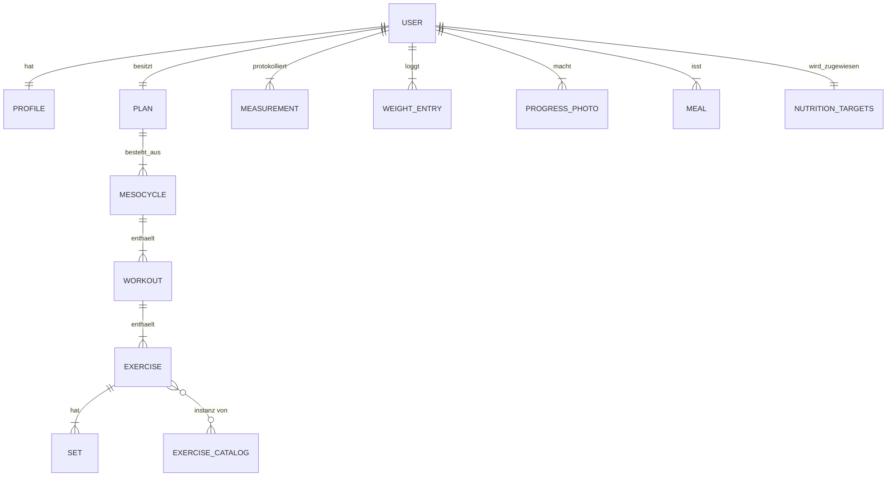

# Analyse: Build With Science (BWS+)

## 1. Einordnung

**Build With Science (BWS)** ist eine evidenz-basierte Fitness- und
Ernährungsplattform, gegründet 2018 von **Jeremy Ethier** (Kinesiologe,
zertifizierter Trainer NASM/FMS/PPSC, ~7 Mio. YouTube-Abonnenten). Das Produkt
hat sich von PDF-/Spreadsheet-Programmen zur All-in-One-App **BWS+**
(Built With Science Holdings Corp / Inc., Vancouver–Blaine WA) entwickelt —
nach Eigenangabe 200.000+ Nutzer.

Kernversprechen: kein „Cookie-Cutter"-Plan, sondern ein **personalisierter,
wöchentlich adaptiver Trainings- und Ernährungsplan**, dessen Empfehlungen auf
publizierter Forschung basieren (Übungen mit Quellenangaben).

## 2. Geschäftsmodell & Monetarisierung

| Aspekt | Wert |
|--------|------|
| Preise | $189 / Jahr · $30 / Monat |
| Trial | 14 Tage, voller Funktionsumfang |
| Pricing-UX | nur Jahresplan prominent, monatlich hinter „alle Pläne" → 75–80 % Jahresanteil |
| Funnel | ~90 % des Traffics → Web-Quiz (zugleich Onboarding), nicht App Store |
| Zusatz | „Gym Buddy" (Partner +15 % Rabatt); ~15 % der Trials, höhere Retention |
| Analytics | Amplitude; in-house-Trainingsstudien speisen Wissenschaft + Marketing |

**Folgerung für uns:** der Assessment-Quiz ist kein Anhängsel, sondern der
**Funnel- und Onboarding-Kern, der den personalisierten Plan erzeugt**. Diese
Verzahnung (Quiz → Plan-Generator) muss architektonisch abgebildet werden.

## 3. Feature-Inventar (Original, vollständig)

Quelle: App-Store-Listing (v3.21.3), Produkt-Review (InsideVerdict 2026),
YouTube-App-Review, RevenueCat-Case-Study.

### 3.1 Onboarding
- **Assessment-Quiz:** Hauptziel (Fettabbau / Muskelaufbau / Recomposition),
  Trainingserfahrung, Equipment, Trainingstage/Woche, Körperdaten, Lifestyle
  → generiert den Plan.
- „Gym Buddy"-Option im Quiz.

### 3.2 Training (Kern)
- **Hyper-personalisierte Workouts:** Algorithmus erzeugt Split, Übungsauswahl,
  Satz-/Wiederholungsziele, Wochenvolumen aus Quiz-Antworten.
- **Progressive-Overload-Anleitung:** pro Session Vorgabe, wie Gewicht &
  Wiederholungen anzupassen sind.
- **Satz-Typen:** Normal, Warm-up, Drop-Set, Deload (wahlbar per Satz-Tap).
- **Rehab-/Regenerationsübungen.**
- **Rest-Timer** integriert.
- Warm-up-Vorschläge pro Einheit.
- „Letztes Training am …"-Label; Workout auf anderen Tag verschiebbar.
- 250+ Übungs-Tutorials (Video, mit Quellenangaben).

### 3.3 Ernährung
- **AI-Meal-Scanner:** Foto der Mahlzeit → automatische Nährwert-Erfassung.
- **Real-Time-Diätanpassung:** Kalorien-/Makroziele wöchentlich angepasst
  (langfristige TDEE-Kalibrierung).
- Kontextuelle Ernährungsberatung.

### 3.4 Tracking & Fortschritt
- Workout-Logging (Sätze, Gewicht, Wiederholung).
- Körpergewicht + Maßen mit Trendanalyse (täglich wiegen → Wochendurchschnitt).
- **Schritte & Aktivitätsziele** (tägliche Check-Liste).
- **Fortschrittsfotos** (vorne/Seite/hinten) + visuelle Körperfett-Schätzung.
- Charts: Gewicht/Strength 30- & 90-Tage (blau = Ist, rot = Wochendurchschnitt).
- Strength-Fortschritt pro Übung.

### 3.5 Education
- **Daily Knowledge Boosters** (200+ Mini-Lektionen).
- 250+ Übungs-Tutorials (s. 3.2).

### 3.6 KI/Intelligence
- **AI-Fitness-/Ernährungs-Assistent („Jeremy AI"):** In-App-Chat auf
  BWS-Methodik-Basis, **mit Zugriff auf die eigenen Log-Daten** (kontextuelle
  statt generische Antworten).
- **Muskelgruppen-Priorisierer:** gezielte Priorisierung bestimmter Muskelgruppen.
- **Recomp-Detektor:** simultane Fett-/Muskel-Analyse.

### 3.7 Integrationen
- Apple Health + Google Fit (Schritte/Aktivität), Apple Watch (watchOS 11+).
- Offline-Zugriff (gym-signal-sicher).

## 4. Domänenmodell (Konzept)

Zentrale **Geschäftsregeln** („was der Algorithmus tut"):

1. **Plan-Generator:** Quiz → Split + Übungsauswahl + Sets/Reps + Wochenvolumen.
2. **Wöchentliche Anpassung** („Killer-Feature"): Log-Ist-Daten → neue
   Zielscores für die nächste Woche (progressiver Overload).
3. **Ernährungsziele:** TDEE/Makros aus Körperdaten + Wochenverlauf, wöchentlich
   neu kalibriert.
4. **Recomp-Detektor:** trennt Muskel- von Fett-Veränderung.

## 5. Meta-Ebene

Die App vereint **vier Produktsphären** gleichzeitig: (1) Coach, (2) Trainer,
(3) Fortschritts-Analytik, (4) Wissens-/Assistenz-Plattform. Genau diese
Kombination ist der Produkt-Verteidigungsmechanismus („ersetzt 3–4 Abonnements").

## 6. Abgleich: Original BWS+ ↔ aktueller Code-Stand

| Fähigkeit | Original BWS+ | Stand im Repo |
|-----------|---------------|----------------|
| Auth (E-Mail + Passwort, Session) | ✅ | ✅ Mock + Supabase-Service (real noch nicht verdrahtet) |
| Workout-Logging (Sätze/Wdh/Gewicht) | ✅ | ✅ `WorkoutStore` (localStorage) |
| Rest-Timer | ✅ | ✅ `restTimer` |
| Übungs-/Workout-Vorlagen | ✅ | ⚠️ nur Default Push/Pull/Beine |
| Progressive Overload (Adaption) | ✅ | ❌ nur Logging, keine Ziel-Vorgabe |
| Ernährungspläne/Meal-Scanner | ✅ | ❌ fehlt |
| Assessment-Quiz → Plan-Generator | ✅ | ❌ fehlt |
| Fortschritts-Analytik (Charts) | ✅ | ⚠️ nur „Verlauf"-Snapshot |
| Körperdaten-/Profil | ✅ | ⚠️ Profil-Form, KPIs als Platzhalter |
| Education / KI-Assistent | ✅ | ❌ fehlt |
| Health-/Fit-Integration | ✅ | ❌ fehlt |

**Fazit:** Das Repo ist Stand heute ein **Workout-Logger** (zustandsloses
Logging in localStorage), noch kein **Coach**. Die Lücke zum Original liegt
v. a. in Plan-Generierung, Adaption, Ernährung und Analytik.