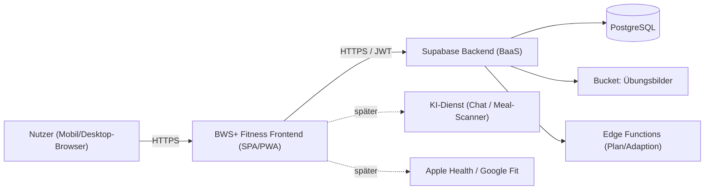
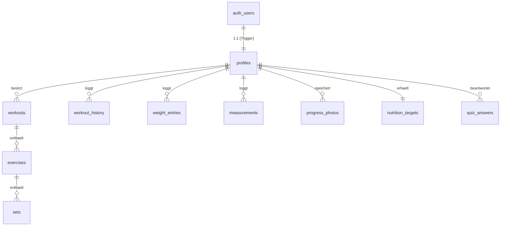
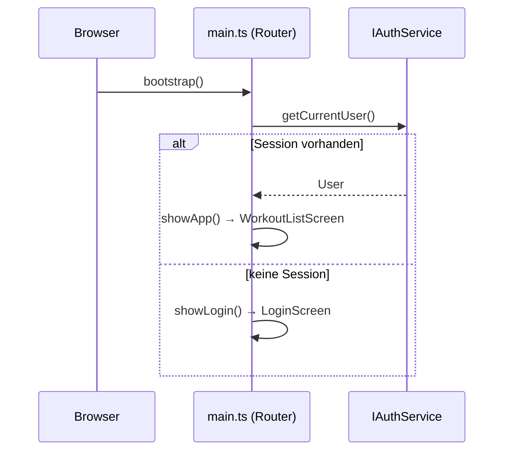
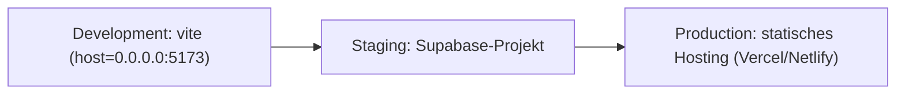

# Software-Architektur — BWS+ Fitness

> Gültigkeitsbereich: Ziel-Architektur für die Phasen 1–3. Deckt die
> Anforderungs-IDs aus `02-anforderungsliste.md` ab. Der Ist-Stand (Punkt 13)
> benennt die Lücken.

## 1. Architekturstil & Leitprinzipien

1. **Schichten-Stil im Frontend** (Screens → Services → Client → Backend):
   UI kennt keine Transportdetails, Services sind framework-agnostische
   Klassen mit Konstruktor-Injektion (heute schon umgesetzt).
2. **Dependency Inversion:** Screens hängen nur an Interfaces
   (`IAuthService`, `IProfileService`, künftig `IWorkoutService`,
   `INutritionService`). Mock- und echte Implementierung tauschbar
   (NFR-MAINT-01).
3. **Backend-as-a-Service (BaaS)** als Kern statt eigener Server:
   **Supabase** (Postgres + Auth + Storage + Edge Functions). Eigene
   Serverlogik nur dort, wo PostgreSQL/Edge Functions nicht reichen
   (Plan-Generator, Adaption, optional KI).
4. **Offline-First** für Workout-Logging: lokal schreiben, asynchron
   synchronisieren (NFR-OFF-01).
5. **Single Source of Truth:** Der Server (Postgres) ist Quelle der Wahrheit;
   localStorage ist nur lokaler Cache für Offline-Nutzung.
6. **Evolution statt Big Bang:** Vanilla TS + Vite bleibt Basis; ein künftiger
   Wechsel auf React/Vue/Svelte tauscht nur die Screen-Schicht, nicht die
   Services.

## 2. Systemkontext (C4, Ebene 1)



- Der Nutzer interagiert ausschließlich mit dem Frontend.
- Das Frontend spricht nie direkt mit der Datenbank — alles über Supabase
  (Auth JWT + PostgREST + Storage) bzw. Edge Functions.

## 3. Container (C4, Ebene 2)

| Container | Technik | Verantwortung | Anforderungen |
|-----------|---------|---------------|---------------|
| Web-Frontend | Vanilla TS, Vite, Tailwind | UI, Routing, State, lokale Persistenz | W-*, PROF-*, T-* |
| Auth-Dienst | Supabase Auth (GoTrue) | Registrierung, Login, Session, Reset | AUTH-* |
| Datenbank | PostgreSQL (Supabase) | Tabellen, Constraints, RLS | NFR-SEC-02, Datenmodell §4 |
| Storage | Supabase Storage | Übungsbilder, Fortschrittsfotos | W-02, T-04 |
| Edge Functions | Deno/TS (Supabase) | Plan-Generierung, wöchentliche Adaption, ggf. KI-Proxy | PLAN-01..03 |
| Extern: Health | Apple Health / Google Fit API | Schritte/Aktivität | INT-01 |
| Extern: KI | LLM-API (über Proxy) | Assistent, Meal-Scanner | AI-01, NUT-02 (Won't jetzt) |

## 4. Datenmodell (Ziel-Schema)

Erweitert die vorhandene `supabase/schema.sql` (dort heute nur `profiles`).



| Tabelle | Wichtige Spalten | Bemerkung |
|---------|------------------|-----------|
| `profiles` | user_id (PK/FK), username, target_goal, starting_weight, current_weight, height, created_at | existiert bereits |
| `workouts` | id, user_id (FK), name, created_at, template_id? | Wochen-/Plan-Einheit (Vorlage optional) |
| `exercises` | id, workout_id (FK), name, target_reps, rest_sec, notes, image_url, sort_order | `image` künftig als Storage-URL statt Base64 |
| `sets` | id, exercise_id (FK), set_index, weight, reps, done, set_type (normal/warmup/dropset/deload) | set_type für W-06 |
| `workout_history` | id, user_id, workout_id?, date, name, total_sets, done_sets, volume | Schnappschuss (W-09) |
| `weight_entries` | id, user_id, date, weight | R-05: Wochen-Durchschnitt |
| `measurements` | id, user_id, date, waist, chest, arms, thighs | PROF-04 |
| `progress_photos` | id, user_id, date, pose (front/side/back), storage_path | T-04 |
| `nutrition_targets` | user_id, calories, protein, carbs, fat, valid_from | NUT-01 (Could) |
| `quiz_answers` | user_id, answers jsonb, plan_version | Input für PLAN-01/02 |
| `exercise_catalog` | id, name, description, cues, video_url, source_refs | EX-01/02 (Should) |
| `templates` | id, name, structure jsonb | PLAN-04 (Push/Pull/Beine …) |

**Regeln auf DB-Ebene:**
- `profiles.target_goal` mit CHECK-Constraint (R-01) — bereits vorhanden.
- `sets.reps > 0`, `sets.weight >= 0` als Constraints.
- RLS auf allen Tabellen: `using (auth.uid() = user_id)` analog zur
  vorhandenen `profiles`-Policy (NFR-SEC-02).
- Trigger `handle_new_user()` erzeugt Profil bei Registrierung — bereits vorhanden.

## 5. Frontend-Architektur (C4, Ebene 3)

```
src/
├── main.ts                  Bootstrap + Navigation (Auth-Gate)
├── screens/                 UI-Schicht (DOM, Events, kein Persistenz-Code)
│   ├── LoginScreen.ts       AUTH-02/06
│   ├── RegisterScreen.ts    AUTH-01/06
│   ├── WorkoutListScreen.ts W-01, T-03
│   ├── WorkoutScreen.ts     W-02..05, Timer-Steuerung
│   ├── ExerciseEditor.ts    W-02 (Formular, Bild)
│   └── ProfileScreen.ts     PROF-01..03
├── services/                Fachlogik (Interface ↔ 2 Implementierungen)
│   ├── authService.ts         # IAuthService ↔ Supabase
│   ├── mockAuthService.ts     # IAuthService ↔ LocalStorage
│   ├── profileService.ts      # IProfileService ↔ Supabase
│   ├── mockProfileService.ts  # IProfileService ↔ LocalStorage
│   ├── workoutStore.ts        # Workout-Logik (heute nur lokale Impl.)
│   ├── restTimer.ts           Timer-Domäne (pur, testbar)
│   ├── validation.ts          Validierung + AuthError (geteilt)
│   └── mockStore.ts           LocalStorage-Speicher für Mock-Auth
├── lib/
│   ├── supabase.ts            Client-Factory (env-basiert)
│   ├── demoUser.ts            Demo-Account-Definition (eine Quelle: Mock-Seed, Login, Testdaten)
│   ├── muscleGroups.ts        Muskelgruppen-Labels/-Optionen
│   └── utils.ts               escapeHtml, formatDuration
└── types.ts                 Typen & Interface-Verträge
```

**Leitlinien:**
- Screens rufen nur Services auf und rendern; Zustand bleibt im Store/Service.
- `IWorkoutService` als eigenes Interface schneiden, sodass neben der
  lokalen `WorkoutStore`-Implementierung eine Supabase-Implementierung
  (mit Offline-Queue) entsteht — gleiche Verträge wie beim Auth-Service.
- `escapeHtml` für alles, was nutzergesteuert in `innerHTML` fließt (XSS).
- Demo-/Testdaten: `main.ts` seedet den Demo-Account (`demo@bws.app`) beim
  ersten Login automatisch aus `public/testdata/seed-workouts.json`
  (`seedDemoData()` im Store, nicht-destruktiv, Datums-Shift auf heute).

## 6. Service-Verträge (Interfaces)

```ts
export interface IAuthService {                      // existiert
  signUp(i: SignUpInput): Promise<User>;
  signIn(e: string, p: string): Promise<User>;
  signOut(): Promise<void>;
  getCurrentUser(): Promise<User | null>;
}

export interface IProfileService {                   // existiert
  getProfile(userId: string): Promise<UserProfile | null>;
}

export interface IWorkoutService {                   // Ziel
  list(since?: Date): Promise<Workout[]>;
  get(id: string): Promise<Workout | null>;
  addWorkout(name: string): Promise<Workout>;
  updateExercise(wid: string, eid: string, p: ExercisePatch): Promise<void>;
  addSet(wid: string, eid: string, s: NewSet): Promise<void>;
  updateSet(wid: string, eid: string, i: number, f: SetField, v: string): Promise<void>;
  toggleSet(wid: string, eid: string, i: number): Promise<boolean>;
  completeWorkout(wid: string): Promise<WorkoutSnapshot | null>;
  sync(): Promise<void>;                            // Offline-Queue → Server
}
```

- `IWorkoutService` übernimmt das Methodenspektrum des heutigen `WorkoutStore`
  (bereits passend geschnitten) und ergänzt `sync()`.
- Mock-Implementierung = heutiger localStorage-Store unverändert.

## 7. Ablauf: Auth-Gate & Navigation



- Kein Router-Framework nötig; der jetzige Callback-Router in `main.ts`
  reicht. Für mehr Reiter (Verlauf, Profil) eine kleine Zustands-Map ergänzen.

## 8. Sicherheitsarchitektur

| Aspekt | Maßnahme | Status |
|--------|----------|--------|
| Auth | Supabase GoTrue + JWT; `persistSession`, `autoRefreshToken` | konfiguriert |
| Autorisierung | Row Level Security auf allen Tabellen | nur `profiles` vorhanden → auf alle Tabellen erweitern |
| Secret-Handling | `VITE_SUPABASE_URL` / `VITE_SUPABASE_ANON_KEY` via `.env`; Service-Role-Key niemals ins Frontend | Konvention ok |
| Passwörter | niemals lokal speichern (Mock nur Dev!) | ✅ |
| XSS | `escapeHtml` für nutzerkontrollierte Strings | ✅ |
| Uploads | Storage-Bucket `exercise-images` mit RLS + Größen-/MIME-Limit | offen |
| DSGVO | Daten minimal erheben, löschbar | offen (Prozess) |

## 9. Architekturentscheidungen (Kurz-ADR)

| # | Entscheidung | Alternativen | Begründung |
|---|--------------|--------------|------------|
| ADR-1 | Vanilla TS + Vite statt React/Next | React/Vue/Svelte | Services bleiben ungekoppelt; geringe Komplexität jetzt; Framework-Swap später nur UI-Schicht |
| ADR-2 | Supabase statt Eigen-API | Fastify/Nest | Auth+DB+RLS+Storage aus einer Hand; schneller MVP; Edge Functions decken Speziallogik |
| ADR-3 | Interface + Mock/Real-Duo statt nur einem Backend | direkt Supabase | Backend spät bindbar, Tests ohne Netz, offline-tauglich |
| ADR-4 | localStorage als Offline-Cache, Postgres als Wahrheit | IndexedDB | einfaches, pro Nutzerid geschlüsseltes Schema |
| ADR-5 | Tailwind via CDN (jetzt) → Build-Integration (später) | Tailwind-CLI | CDN schnell für Dev; vor Produktion auf Build-JIT umstellen |

## 10. Deployment & Umgebungen



- `npm run build` → statische Assets (SPA). Hosting: Vercel/Netlify/Pages.
- Env-Variablen je Umgebung; `.env` lokal, `.env.production` im CI/CD.
- Migrationsdateien (`supabase/schema.sql` → später `supabase/migrations/`).

## 11. Teststrategie

| Ebene | Werkzeug | Umfang |
|-------|----------|--------|
| Unit | Vitest | Services (RestTimer, WorkoutStore, Validierung) |
| Integration | Vitest + Node | Auth-Flows am Interface (Mock ↔ Real) |
| E2E | Playwright | Happy Path: Registrierung → Push-Vorlage → Satz → RestTimer → Abschluss |
| Type | `tsc --noEmit` | CI-Gate (läuft aktuell ✅) |

## 12. Querschnittsthemen & Monitoring

- **Fehler-Handling:** typisierte `AuthError` (existiert) → Verallgemeinerung
  auf `AppError` für Workout-/Profil-Fehler (gleiches Muster wie `validation.ts`).
- **Logging/Analytics:** in Phase 2 datenschutzkonform (PostHog/Plausible) — optional.
- **Performance:** Code-Splitting später; Ziel < 200 kB initiales JS.

## 13. Gap-Analyse: Ist → Ziel (Fokus für nächste Iterationen)

| Lücke | Nötig | Referenz |
|-------|-------|----------|
| ✅ erledigt | Supabase real verdrahtet (W1): Factory je `VITE_*`-Env; Fallback Mock (ADR-3) | ADR-3 |
| `IWorkoutService` + Supabase-Workout-Implementierung | Schema §4 + Offline-Queue | W-* |
| Workout-Sync (localStorage ↔ Postgres) | `sync()` idempotent (Upsert via ID) | NFR-OFF-01 |
| Workout-Schema/DB fehlt | Migration + RLS auf neuen Tabellen | NFR-SEC-02 |
| Satz-Typen (W-06) fehlen | `set_type` im Schema + UI-Auswahl | W-06 |
| Profil-KPIs sind Platzhalter | Aggregat-Queries auf History/Weight | T-01..05 |
| Plan-Generator (Quiz → Plan) | Edge Function (später) | PLAN-01..03 |